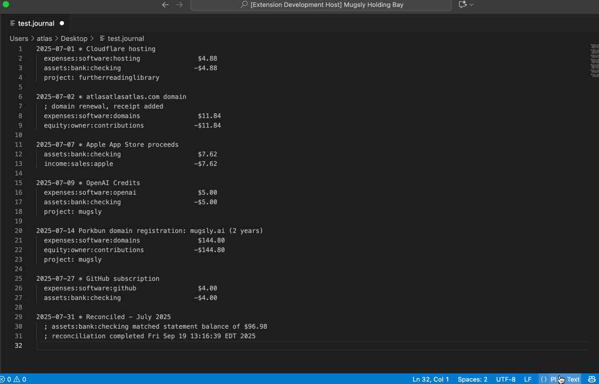
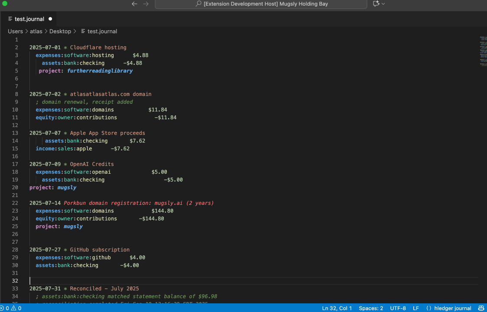
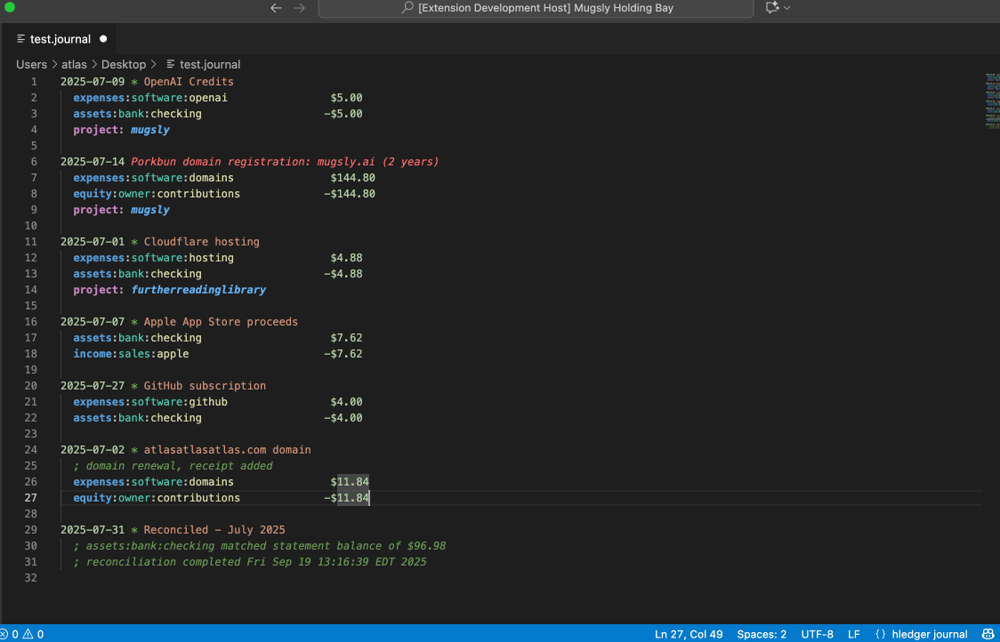

# HLedger Formatter

A VS Code extension to make editing hledger journal files a bit more fun.

[HLedger](https://hledger.org/) is an awesome plain text cli accounting tool. This extension adds syntax highlighting, formatting, sorting, and other quality-of-life improvements to make editing these files easier.

## Features

- Automatically aligns account names and amounts in hledger journal files
- Rich syntax highlighting with hierarchical account coloring
- Sort journal entries by date (`Shift+Cmd+S`)
- Sort on save option (enabled by default)
- Toggle comment lines (`Cmd+/`)

## Demo

### Syntax Highlighting
Rich syntax highlighting with hierarchical account coloring and project tags:



### Automatic Formatting
Aligns amounts to a configurable column position for clean, readable journal files:



### Sort by Date
Automatically sorts transactions chronologically:



## Supported File Types

- `.journal`
- `.hledger`
- `.ledger`

## Usage

1. Open a hledger journal file
2. Set the file language mode to `hledger`
2. Use one of these methods to format:
   - Press `Shift+Alt+F`
   - Right-click and select "Format hledger Journal" from the context menu
   - Save the file (if format on save is enabled)

## Extension Settings

This extension contributes the following settings:

* `hledger-formatter.formatOnSave`: Enable/disable formatting on save (default: true)
* `hledger-formatter.sortOnSave`: Enable/disable sorting entries by date on save (default: true)
* `hledger-formatter.amountColumnPosition`: Column position for aligning amounts (default: 42, range: 20-100)

## Example

Before formatting:

```

2023-01-05   Grocery Store
  expenses:food      $85.50
    assets:bank:checking    $-85.50


2023-01-10 Coffee Shop
 expenses:dining:coffee  $4.75
   assets:cash  $-4.75
```

After formatting:

```
2023-01-05 Grocery Store
  expenses:food                           $85.50
  assets:bank:checking                   -$85.50

2023-01-10 Coffee Shop
  expenses:dining:coffee                  $4.75
  assets:cash                            -$4.75
```

## Release Notes

### 1.0.0

Initial release of hledger Formatter

## Requirements

- VS Code 1.60.0 or newer

## Support

For help and support, see [SUPPORT.md](SUPPORT.md) or email hledger@atlasatlasatlas.com

- **Issues & Bug Reports**: [GitHub Issues](https://github.com/iiAtlas/hledger-formatter/issues)
- **Source Code**: [GitHub Repository](https://github.com/iiAtlas/hledger-formatter)
- **VS Code Marketplace**: [hledger-formatter](https://marketplace.visualstudio.com/items?itemName=iiAtlas.hledger-formatter)

## License

GPL-3.0 - see the [LICENSE.md](LICENSE.md) file for details
